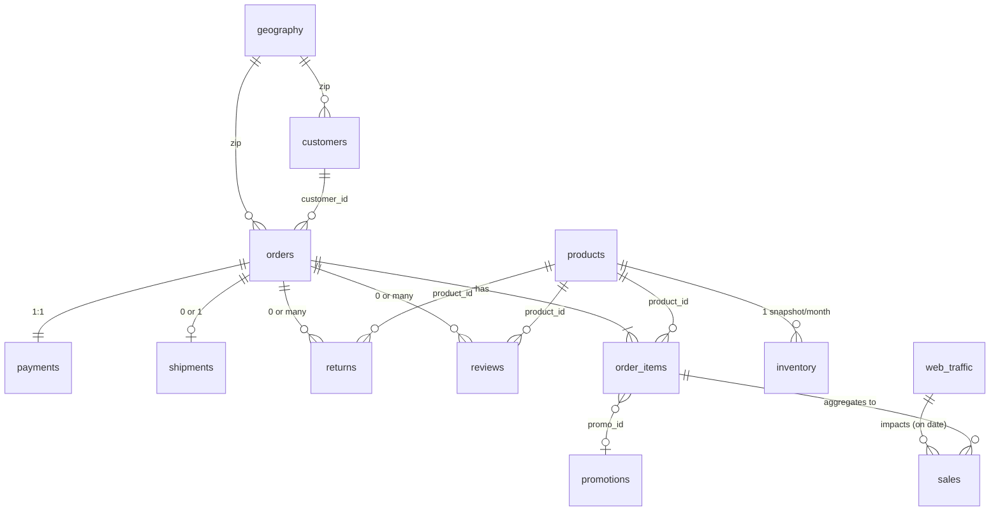

# 🏆 Dự án Bốn Con Cừu — Datathon 2026

Chào mừng bạn đến với giải pháp phân tích dữ liệu và dự báo doanh thu của đội **Bốn Con Cừu**. Dự án này được thiết kế để giải quyết bài toán tối ưu hóa vận hành cho một doanh nghiệp thương mại điện tử thời trang hàng đầu tại Việt Nam.

---

## 📌 1. Bối cảnh & Mục tiêu (Business Context)
Doanh nghiệp sở hữu hệ thống dữ liệu khổng lồ từ năm 2012 đến 2022. Thách thức lớn nhất là chuyển đổi hàng triệu dòng giao dịch thành các quyết định kinh doanh thực tế:
- ✅ **Tối ưu tồn kho**: Dự báo chính xác nhu cầu để giảm chi phí lưu kho.
- ✅ **Chiến lược khách hàng**: Phân loại và giữ chân khách hàng VIP (Champions) có giá trị cao.
- ✅ **Hiệu quả Marketing**: Định lượng ROI của từng kênh tiếp thị dựa trên giá trị vòng đời (**CLV**).

---

## 📁 2. Cấu trúc dự án (Project Architecture)

```
bốn con cừu/
├── DATATHON2026_BỐN-CON-CỪU.pdf # [REPORT] Báo cáo chi tiết dự án
├── database/           # [INPUT] 15 file CSV dữ liệu thô (Master & Transaction)
├── notebooks/          # [PROCESS] Luồng thực thi chính
│   ├── PART1.ipynb     # Khám phá dữ liệu & Trả lời 10 câu hỏi EDA
│   ├── PART2.ipynb     # PART 2: EDA, SQL & CUSTOMER STRATEGY (RFM-CLV ANALYTICS)
│   └── PART3.ipynb     # Mô hình dự báo Revenue & COGS (Hybrid Ensemble)
├── output/             # [OUTPUT] Kết quả xuất bản chuyên nghiệp
│   ├── figures/        # Biểu đồ phân tích (Waterfall, Gauge, Treemap...)
│   ├── forecasting/    # File nộp bài (submission.csv) và biểu đồ dự báo
│   ├── tables/         # Báo cáo chi tiết (RFM Audit, ROI scenarios)
│   └── processed/      # Master Dataset sạch (master_orders_final.csv.gz)
├── src/                # [ENGINE] Mã nguồn modular (Analysis, Config, Visualization)
├── requirements.txt    # Danh sách thư viện cần thiết
└── README.md           # [DOCS] Hướng dẫn dự án này (Bạn đang xem)
```

---

## 📊 3. Hệ thống dữ liệu & Thiết kế logic (Data Ecosystem)

Hệ thống bao gồm 15 bảng dữ liệu được kết nối chặt chẽ theo sơ đồ thực thể (ERD):



### Phân lớp dữ liệu:
- **Master Data**: Thông tin gốc về `products` (Giá vốn/Giá bán), `customers`, `promotions` (Logic giảm giá), `geography`.
- **Transaction Data**: Nhật ký giao dịch `orders`, `order_items`, `payments`, `returns` (Lý do trả hàng).
- **Operational Data**: Dữ liệu vận hành `inventory` (Chụp tồn kho hàng tháng), `web_traffic` (Sessions/Bounce Rate).

---

## 🧠 4. Quy trình Phân tích Chiến lược (PART 2)

Chúng tôi triển khai luồng phân tích khách hàng 7 bước dựa trên mô hình RFM & CLV:

### 📑 Phương pháp chấm điểm RFM (Audited):
| Chỉ số | Cách tính | Ý nghĩa |
| :--- | :--- | :--- |
| **Recency** | Số ngày từ đơn cuối đến 31/12/2022 | Mức độ tương tác gần nhất |
| **Frequency** | Tổng số đơn hàng không hủy | Mức độ trung thành |
| **Monetary** | Tổng doanh thu thực thu (NMV) | Đóng góp tài chính |

### 🎯 Chiến lược hành động theo phân khúc:
- **Champions / Loyal**: Triển khai chương trình "Thân thiết", quyền mua sớm sản phẩm mới. Tuyệt đối không lạm dụng Discount.
- **Potential Loyalist**: Gửi kịch bản "Onboarding", tặng voucher cho lần mua thứ 2.
- **At Risk / Can't Lose Them**: Kích hoạt chiến dịch "Win-back" với mức chiết khấu cao để cứu vãn dòng tiền.

---

## 🔮 5. Mô hình Dự báo tương lai (PART 3)

Để đạt được độ chính xác cao nhất cho bài toán Kaggle, chúng tôi sử dụng mô hình **Hybrid Ensemble**:
- **Thuật toán**: Kết hợp LightGBM, XGBoost và Prophet.
- **Xử lý đặc thù**: Tích hợp thuật toán **Tet-Smooth** để "mượt hóa" dữ liệu vào các giai đoạn Tết Nguyên Đán tại Việt Nam.
- **Dự báo**: 548 ngày tiếp theo (2023 - 01/07/2024).

---

## 🛠️ 6. Hướng dẫn Tái lập kết quả

1.  **Cài đặt:** `pip install -r requirements.txt` (Dùng `pip3` trên MacOS).
2.  **Thứ tự:** Chạy lần lượt các Notebook trong thư mục `notebooks/`.
3.  **Kết quả:** Toàn bộ ảnh báo cáo và file nộp bài sẽ tự động xuất hiện trong thư mục `output/`.

---
## ** Dự án thực hiện bởi đội Bốn Con Cừu ** ##
