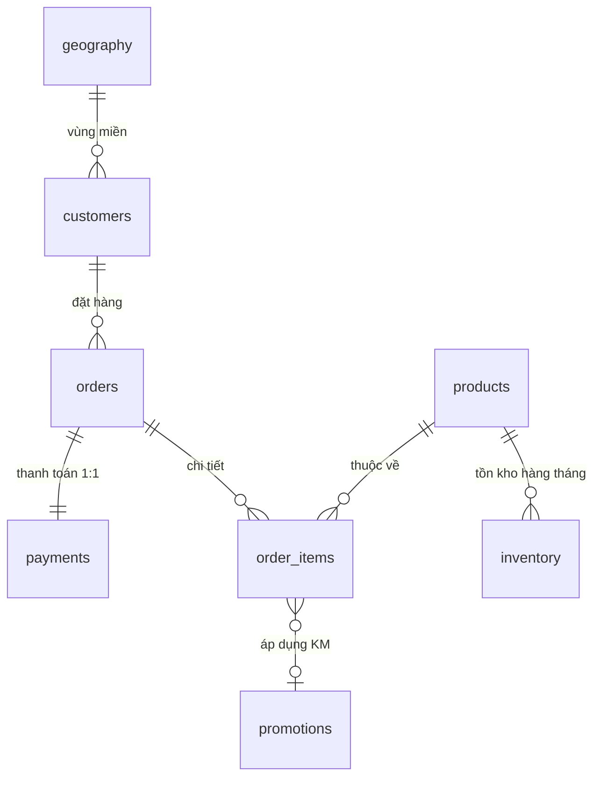

# 🏆 Dự án Bốn Con Cừu — Datathon 2026

Chào mừng bạn đến với giải pháp phân tích dữ liệu và dự báo doanh thu của đội **Bốn Con Cừu**. Dự án này được xây dựng nhằm giải quyết bài toán tối ưu hóa vận hành và chiến lược khách hàng cho một doanh nghiệp thương mại điện tử thời trang tại Việt Nam.

---

## 📌 3 Trụ cột chiến lược (Strategic Pillars)
Dự án tập trung vào việc chuyển đổi dữ liệu thô thành giá trị kinh doanh thông qua:
1.  **Exploratory Data Analysis (EDA)**: Giải mã hành vi khách hàng và hiệu suất sản phẩm qua 10 năm dữ liệu (2012-2022).
2.  **Customer Intelligence**: Phân khúc khách hàng chiến lược (RFM) và dự báo giá trị vòng đời (**Predictive CLV**).
3.  **Financial Forecasting**: Dự báo Doanh thu & Giá vốn 2023-2024 với thuật toán xử lý biến động mùa vụ Tết (**Tet-Smooth Ensemble**).

---

## 📁 Cấu trúc dự án (Project Architecture)

```
bốn con cừu/
├── database/           # [INPUT] 15 file CSV dữ liệu thô (Master & Transaction)
├── notebooks/          # [PROCESS] Luồng thực thi chính
│   ├── PART1.ipynb     # Khám phá dữ liệu & Trả lời 10 câu hỏi EDA
│   ├── PART2.ipynb     # PART 2: EDA, SQL & CUSTOMER STRATEGY (RFM-CLV ANALYTICS)
│   └── PART3.ipynb     # Mô hình dự báo Revenue & COGS (Hybrid Ensemble)
├── output/             # [OUTPUT] Kết quả xuất bản chuyên nghiệp
│   ├── figures/        # Biểu đồ phân tích (Waterfall, Gauge, Treemap, Bubble...)
│   ├── forecasting/    # File nộp bài (submission.csv) và biểu đồ xu hướng
│   ├── tables/         # Báo cáo chi tiết (RFM Audit, Marketing ROI, Top Categories)
│   └── processed/      # Master Dataset sạch (master_orders_final.csv.gz)
├── src/                # [ENGINE] Mã nguồn modular
│   ├── analysis/       # Logic phân tích RFM, CLV, Marketing
│   ├── config/         # Cấu hình đường dẫn động (paths.py)
│   ├── data/           # Bộ nạp dữ liệu (loader.py)
│   ├── features/       # Feature Engineering & CLV Modeling
│   └── visualization/  # Thư viện vẽ biểu đồ chuyên sâu
└── requirements.txt    # Danh sách thư viện (Plotly, Kaleido, Lifetimes, XGBoost...)
```

---

## 📊 Hệ thống dữ liệu & Sơ đồ quan hệ (ERD)

Dự án xử lý dữ liệu từ 15 bảng quan hệ phức tạp. Chúng tôi đã thiết kế lại sơ đồ logic để tối ưu hóa việc truy vấn (SQL Joins):



### 🗂 Các lớp dữ liệu chính:
- **Master Data**: Thông tin gốc về `products`, `customers`, `promotions`, `geography`.
- **Transaction Data**: Nhật ký giao dịch `orders`, `order_items`, `payments`, `shipments`, `returns`, `reviews`.
- **Operational Data**: Dữ liệu vận hành `inventory`, `web_traffic`.

---

## 🧠 Quy trình phân tích RFM & Chiến lược khách hàng (PART 2)

Chúng tôi áp dụng mô hình RFM (Recency, Frequency, Monetary) kết hợp với **BG/NBD & Gamma-Gamma** để phân loại khách hàng:

| Phân khúc | Đặc điểm chiến lược |
| :--- | :--- |
| **Champions** | Khách hàng VIP, mua gần đây nhất, thường xuyên nhất và chi tiêu nhiều nhất. |
| **Loyal Customers** | Khách hàng trung thành, chi tiêu ổn định, cần chương trình ưu đãi riêng. |
| **At Risk** | Khách hàng từng mua rất nhiều nhưng đã lâu không quay lại. Cần chiến dịch Win-back. |
| **Can't Lose Them** | Nhóm chi tiêu cực lớn nhưng sắp rời bỏ. Cần can thiệp trực tiếp. |
| **Lost** | Khách hàng đã rời bỏ hoàn toàn, không nên tập trung ngân sách Marketing. |

---

## 🔮 Mô hình dự báo Hybrid (PART 3)

Mô hình dự báo của chúng tôi không chỉ dựa trên thống kê đơn thuần mà tích hợp các yếu tố vận hành:
- **Hybrid Ensemble**: Kết hợp **LightGBM**, **XGBoost** và **Prophet** để đạt độ chính xác tối ưu trên Kaggle.
- **Tet-Smooth Logic**: Thuật toán đặc biệt giúp "mượt hóa" dữ liệu vào các giai đoạn Tết Nguyên Đán (vốn là điểm nhiễu lớn nhất của dữ liệu TMĐT tại Việt Nam).
- **Feature Engineering**: Tích hợp các chỉ số từ `web_traffic` và `inventory_health` làm biến dẫn dắt (leading indicators) cho dự báo doanh thu.

---

## 🛠️ Hướng dẫn cài đặt & Tái lập kết quả

1.  **Cài đặt thư viện:**
    ```bash
    pip install -r requirements.txt
    ** hoặc ** 
    pip3 install -r requirements.txt (MacOS)

    ```

2.  **Cách chạy:**
    - Chạy lần lượt các Notebook trong thư mục `notebooks/`.
    - Toàn bộ kết quả (Ảnh, CSV) sẽ được tự động lưu vào thư mục `output/` để bạn dễ dàng đóng gói nộp bài.

3.  **Lưu ý kỹ thuật:**
    - Hệ thống sử dụng đường dẫn động (Pathlib), bạn có thể chạy dự án trên bất kỳ máy tính nào mà không cần sửa code.

---
## ** Dự án thực hiện bởi đội Bốn Con Cừu ** ##
